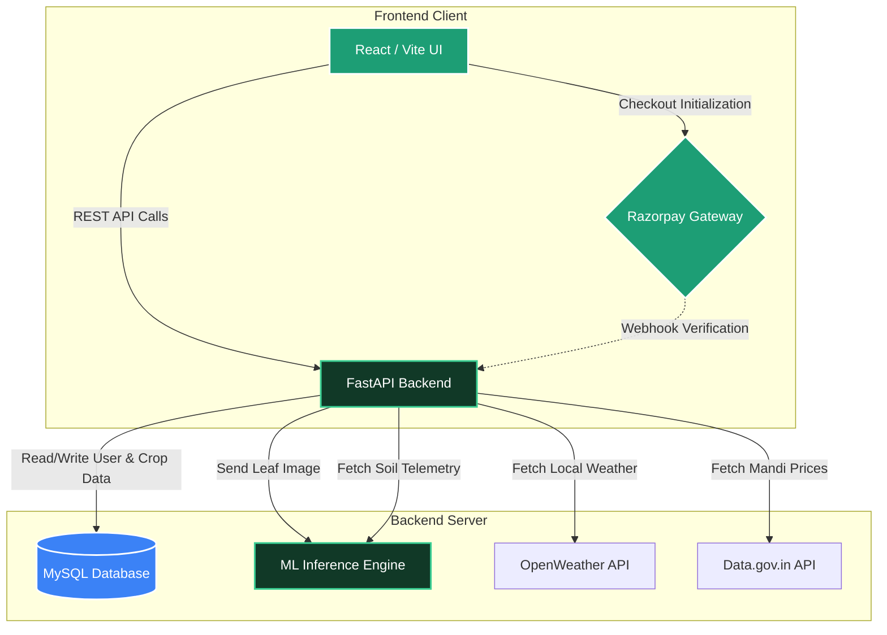
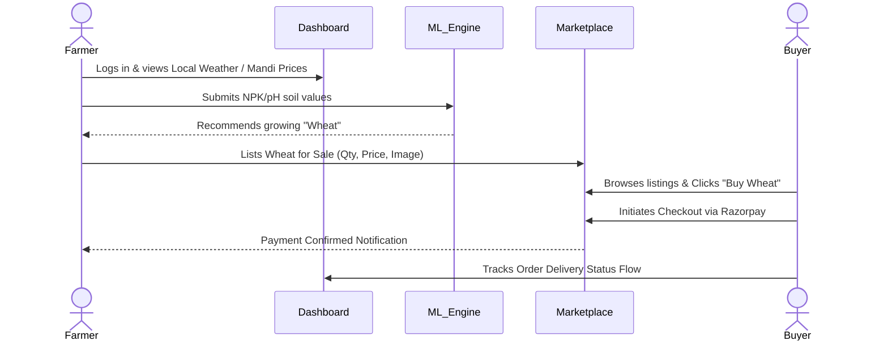

<div align="center">
  
# 🌱 Agro-Soil AI Innovation 🚀

**An Intelligent, Modern, Dual-Role Agricultural Platform for the Farmers of Bharat**

[](https://fastapi.tiangolo.com/)
[](https://react.dev/)
[](https://tailwindcss.com/)
[](https://www.mysql.com/)

</div>

<br />

## 📖 Overview

Agro-Soil AI is a full-stack, AI-driven platform designed to modernize agriculture and empower Indian farmers. It bridges the gap between agricultural technology and market access by offering Machine Learning-powered **Crop Recommendations**, Computer Vision-based **Disease Detection**, and a seamless integrated **Peer-to-Peer Marketplace** all wrapped in a beautifully animated, dark-mode glassmorphism UI.

---

## ✨ Core Features

* 🧑‍🌾 **Dual-Role Authenticaton**: Dedicated flows tailored for **Farmers** (analytical data, selling) and **Buyers** (browsing, purchasing).
* 🌾 **AI Crop Recommendation**: Input specific soil metrics (N, P, K, pH) and the ML model suggests the most optimal crops to maximize yield.
* 🌿 **Leaf Disease Detection**: Instantly diagnose plant health by uploading a leaf image. Receive species detection, sickness severity, and active treatments.
* 📈 **Live Mandi Prices**: Pulls realtime, localized wholesale agricultural commodity prices directly from the Indian Government's Open Data API (`data.gov.in`).
* 🛒 **P2P Marketplace**: Farmers can list directly from their dashboard. Buyers can browse, filter, and simulate secure purchases using the **Razorpay Payment Gateway**.
* 🚚 **Interactive Order Tracking & Analytics**: Farmers view monthly earnings securely charted with Recharts. Buyers can visually track dummy delivery statuses across an animated timeline.

---

## 🛠️ Tech Stack

#### **Frontend Layers**
- **Framework**: React.js 18 + Vite
- **Styling**: Tailwind CSS (Fully customized Dark-Mode UI + Glassmorphism)
- **Animations**: GSAP (ScrollTriggers) & Framer-Motion (Micro-interactions)
- **Data Visualization**: Recharts (for Dashboard earnings)

#### **Backend & ML Layers**
- **Server**: FastAPI (Python) running on Uvicorn
- **Database**: MySQL integrated with SQLAlchemy ORM
- **Machine Learning**: Custom algorithms & Scikit-learn (Random Forests) for crop analysis. Computer Vision integration for image parsing.

#### **External APIs**
- **Razorpay API**: Secure payment simulation.
- **Data.gov.in API**: Live Indian Mandi pricing.
- **OpenWeatherMap API**: Localized dashboard weather telemetry.

---

## 🏗️ System Architecture



---

## 🧭 Workflow Journey



---

## 🚀 Getting Started

Follow these steps to set up the project locally for development.

### 1. Database Setup
1. Ensure you have **XAMPP** (or a local MySQL server) installed.
2. Start the **MySQL** module.
3. Open PhpMyAdmin or your SQL CLI and create an empty database named `agrosoilai`.

### 2. Backend Configuration
1. Open a terminal and navigate to the backend folder:
   ```bash
   cd backend
   ```
2. Create and activate a Virtual Environment (optional but recommended):
   ```bash
   python -m venv venv
   .\venv\Scripts\activate
   ```
3. Install Python dependencies:
   ```bash
   pip install -r requirements.txt
   ```
4. Create a `.env` file in the `backend/` directory with the following variables:
   ```env
   DATABASE_URL=mysql+pymysql://root:@localhost:3306/agrosoilai
   SECRET_KEY=generate_a_random_32_character_string_here
   ALGORITHM=HS256
   ACCESS_TOKEN_EXPIRE_MINUTES=60
   REFRESH_TOKEN_EXPIRE_DAYS=7
   
   # API Keys
   OPENWEATHERMAP_API_KEY=your_openweathermap_key_here
   RAZORPAY_KEY_ID=rzp_test_yourkey
   RAZORPAY_KEY_SECRET=your_razorpay_secret
   DATA_GOV_API_KEY=your_gov_api_key
   ```
5. Start the FastAPI server (it will automatically seed the database):
   ```bash
   uvicorn main:app --reload --port 8000
   ```

### 3. Frontend Configuration
1. Open a **new** terminal and navigate to the frontend folder:
   ```bash
   cd frontend
   ```
2. Install standard Node dependencies:
   ```bash
   npm install
   ```
3. Ensure you have a `.env` file in the frontend root linking to the backend:
   ```env
   VITE_API_BASE_URL=http://127.0.0.1:8000/api
   ```
4. Start the Vite development server:
   ```bash
   npm run dev
   ```
5. Open your browser to `http://localhost:5173` to view the application!

---

> _"Empowering the hands that feed the world, one dataset at a time."_ 🚜🌾
